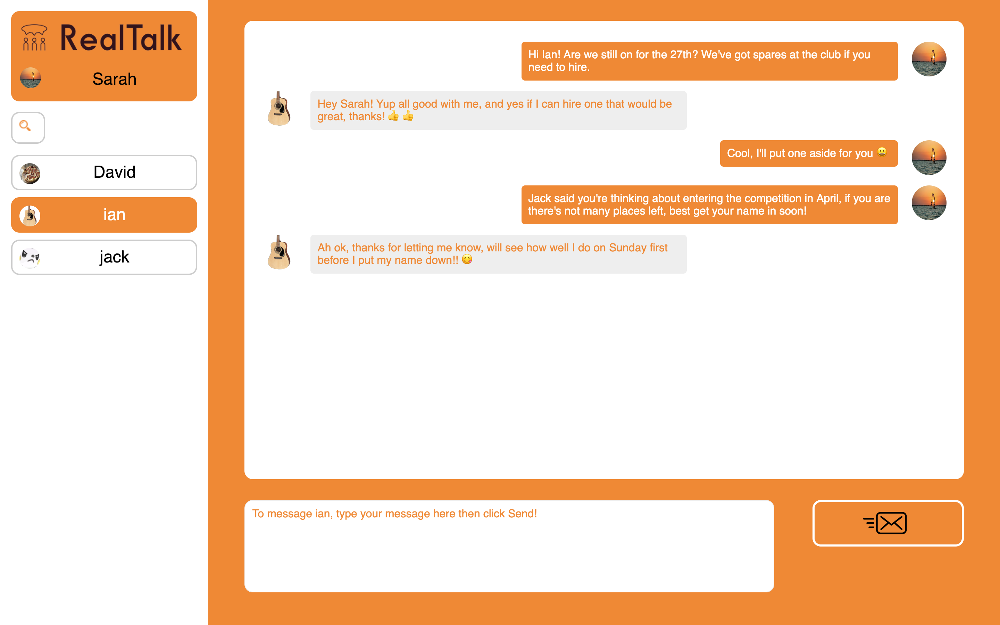

# Realtalk - A Javascript webchat app with a Rails API backend!

[Video Demo](https://www.youtube.com/watch?v=PpVr8HZXb6I)

RealTalk was built as a Module 3 Project at Flatiron School in collaboration with [Lingy94](http://github.com/Lingy94). The brief was to build a web app with a Rails API backend and a Javscript based frontend without using any JS libraries. The backend Rails API is hosted [here](https://github.com/Lingy94/realtalk-server)

Users can create a basic account with a profile picture, search for other existing RealTalk users and start chats with them. If two users run this frontend on two separate browsers and both connect to the same instance of the API server they will be able to talk to each other in real time.

Strech goals that we were planning to add before running out of time included:

  - Ability to receive notifications if someone sends you a message and you aren't currently chatting to them
  - Ability to delete conversations and messages within them
  - Add time/date stamps to individual messages
  - Add an emoji selector box to the message input text area

Whilst there are plenty of existing technologies that we could have used to build this app to a professional level much more easily, learning to build this level of functionality with vanilla JS was a great learning exercise and really helped us solidify our understanding of the fundamentals of Javascript.

** PLEASE NOTE **
-----------------

- For people wishing to test the realtime functionality of RealTalk, if you aren't running the backend server on your machine, you will need to replace the baseUrl constant link at top of the 'script.js' file with the IP address of the machine the server is running on, plus the Rails port (normally :3000)

-----------------

